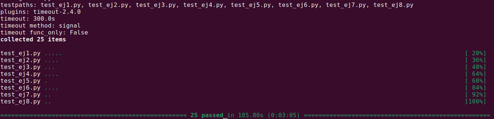

# TP0: Docker + Comunicaciones + Concurrencia

En el presente repositorio se provee un esqueleto básico de cliente/servidor, en donde todas las dependencias del mismo se encuentran encapsuladas en containers. Los alumnos deberán resolver una guía de ejercicios incrementales, teniendo en cuenta las condiciones de entrega descritas al final de este enunciado.

 El cliente (Golang) y el servidor (Python) fueron desarrollados en diferentes lenguajes simplemente para mostrar cómo dos lenguajes de programación pueden convivir en el mismo proyecto con la ayuda de containers, en este caso utilizando [Docker Compose](https://docs.docker.com/compose/).

## Instrucciones de uso
El repositorio cuenta con un **Makefile** que incluye distintos comandos en forma de targets. Los targets se ejecutan mediante la invocación de:  **make \<target\>**. Los target imprescindibles para iniciar y detener el sistema son **docker-compose-up** y **docker-compose-down**, siendo los restantes targets de utilidad para el proceso de depuración.

Los targets disponibles son:

| target  | accion  |
|---|---|
|  `docker-compose-up`  | Inicializa el ambiente de desarrollo. Construye las imágenes del cliente y el servidor, inicializa los recursos a utilizar (volúmenes, redes, etc) e inicia los propios containers. |
| `docker-compose-down`  | Ejecuta `docker-compose stop` para detener los containers asociados al compose y luego  `docker-compose down` para destruir todos los recursos asociados al proyecto que fueron inicializados. Se recomienda ejecutar este comando al finalizar cada ejecución para evitar que el disco de la máquina host se llene de versiones de desarrollo y recursos sin liberar. |
|  `docker-compose-logs` | Permite ver los logs actuales del proyecto. Acompañar con `grep` para lograr ver mensajes de una aplicación específica dentro del compose. |
| `docker-image`  | Construye las imágenes a ser utilizadas tanto en el servidor como en el cliente. Este target es utilizado por **docker-compose-up**, por lo cual se lo puede utilizar para probar nuevos cambios en las imágenes antes de arrancar el proyecto. |
| `build` | Compila la aplicación cliente para ejecución en el _host_ en lugar de en Docker. De este modo la compilación es mucho más veloz, pero requiere contar con todo el entorno de Golang y Python instalados en la máquina _host_. |

### Servidor

Se trata de un "echo server", en donde los mensajes recibidos por el cliente se responden inmediatamente y sin alterar. 

Se ejecutan en bucle las siguientes etapas:

1. Servidor acepta una nueva conexión.
2. Servidor recibe mensaje del cliente y procede a responder el mismo.
3. Servidor desconecta al cliente.
4. Servidor retorna al paso 1.


### Cliente
 se conecta reiteradas veces al servidor y envía mensajes de la siguiente forma:
 
1. Cliente se conecta al servidor.
2. Cliente genera mensaje incremental.
3. Cliente envía mensaje al servidor y espera mensaje de respuesta.
4. Servidor responde al mensaje.
5. Servidor desconecta al cliente.
6. Cliente verifica si aún debe enviar un mensaje y si es así, vuelve al paso 2.

### Ejemplo

Al ejecutar el comando `make docker-compose-up`  y luego  `make docker-compose-logs`, se observan los siguientes logs:

```
client1  | 2024-08-21 22:11:15 INFO     action: config | result: success | client_id: 1 | server_address: server:12345 | loop_amount: 5 | loop_period: 5s | log_level: DEBUG
client1  | 2024-08-21 22:11:15 INFO     action: receive_message | result: success | client_id: 1 | msg: [CLIENT 1] Message N°1
server   | 2024-08-21 22:11:14 DEBUG    action: config | result: success | port: 12345 | listen_backlog: 5 | logging_level: DEBUG
server   | 2024-08-21 22:11:14 INFO     action: accept_connections | result: in_progress
server   | 2024-08-21 22:11:15 INFO     action: accept_connections | result: success | ip: 172.25.125.3
server   | 2024-08-21 22:11:15 INFO     action: receive_message | result: success | ip: 172.25.125.3 | msg: [CLIENT 1] Message N°1
server   | 2024-08-21 22:11:15 INFO     action: accept_connections | result: in_progress
server   | 2024-08-21 22:11:20 INFO     action: accept_connections | result: success | ip: 172.25.125.3
server   | 2024-08-21 22:11:20 INFO     action: receive_message | result: success | ip: 172.25.125.3 | msg: [CLIENT 1] Message N°2
server   | 2024-08-21 22:11:20 INFO     action: accept_connections | result: in_progress
client1  | 2024-08-21 22:11:20 INFO     action: receive_message | result: success | client_id: 1 | msg: [CLIENT 1] Message N°2
server   | 2024-08-21 22:11:25 INFO     action: accept_connections | result: success | ip: 172.25.125.3
server   | 2024-08-21 22:11:25 INFO     action: receive_message | result: success | ip: 172.25.125.3 | msg: [CLIENT 1] Message N°3
client1  | 2024-08-21 22:11:25 INFO     action: receive_message | result: success | client_id: 1 | msg: [CLIENT 1] Message N°3
server   | 2024-08-21 22:11:25 INFO     action: accept_connections | result: in_progress
server   | 2024-08-21 22:11:30 INFO     action: accept_connections | result: success | ip: 172.25.125.3
server   | 2024-08-21 22:11:30 INFO     action: receive_message | result: success | ip: 172.25.125.3 | msg: [CLIENT 1] Message N°4
server   | 2024-08-21 22:11:30 INFO     action: accept_connections | result: in_progress
client1  | 2024-08-21 22:11:30 INFO     action: receive_message | result: success | client_id: 1 | msg: [CLIENT 1] Message N°4
server   | 2024-08-21 22:11:35 INFO     action: accept_connections | result: success | ip: 172.25.125.3
server   | 2024-08-21 22:11:35 INFO     action: receive_message | result: success | ip: 172.25.125.3 | msg: [CLIENT 1] Message N°5
client1  | 2024-08-21 22:11:35 INFO     action: receive_message | result: success | client_id: 1 | msg: [CLIENT 1] Message N°5
server   | 2024-08-21 22:11:35 INFO     action: accept_connections | result: in_progress
client1  | 2024-08-21 22:11:40 INFO     action: loop_finished | result: success | client_id: 1
client1 exited with code 0
```


## Parte 1: Introducción a Docker
En esta primera parte del trabajo práctico se plantean una serie de ejercicios que sirven para introducir las herramientas básicas de Docker que se utilizarán a lo largo de la materia. El entendimiento de las mismas será crucial para el desarrollo de los próximos TPs.

### Ejercicio N°1:
Definir un script de bash `generar-compose.sh` que permita crear una definición de Docker Compose con una cantidad configurable de clientes.  El nombre de los containers deberá seguir el formato propuesto: client1, client2, client3, etc. 

El script deberá ubicarse en la raíz del proyecto y recibirá por parámetro el nombre del archivo de salida y la cantidad de clientes esperados:

`./generar-compose.sh docker-compose-dev.yaml 5`

Considerar que en el contenido del script pueden invocar un subscript de Go o Python:

```
#!/bin/bash
echo "Nombre del archivo de salida: $1"
echo "Cantidad de clientes: $2"
python3 mi-generador.py $1 $2
```

En el archivo de Docker Compose de salida se pueden definir volúmenes, variables de entorno y redes con libertad, pero recordar actualizar este script cuando se modifiquen tales definiciones en los sucesivos ejercicios.

### Ejercicio N°2:
Modificar el cliente y el servidor para lograr que realizar cambios en el archivo de configuración no requiera reconstruír las imágenes de Docker para que los mismos sean efectivos. La configuración a través del archivo correspondiente (`config.ini` y `config.yaml`, dependiendo de la aplicación) debe ser inyectada en el container y persistida por fuera de la imagen (hint: `docker volumes`).


### Ejercicio N°3:
Crear un script de bash `validar-echo-server.sh` que permita verificar el correcto funcionamiento del servidor utilizando el comando `netcat` para interactuar con el mismo. Dado que el servidor es un echo server, se debe enviar un mensaje al servidor y esperar recibir el mismo mensaje enviado.

En caso de que la validación sea exitosa imprimir: `action: test_echo_server | result: success`, de lo contrario imprimir:`action: test_echo_server | result: fail`.

El script deberá ubicarse en la raíz del proyecto. Netcat no debe ser instalado en la máquina _host_ y no se pueden exponer puertos del servidor para realizar la comunicación (hint: `docker network`). `


### Ejercicio N°4:
Modificar servidor y cliente para que ambos sistemas terminen de forma _graceful_ al recibir la signal SIGTERM. Terminar la aplicación de forma _graceful_ implica que todos los _file descriptors_ (entre los que se encuentran archivos, sockets, threads y procesos) deben cerrarse correctamente antes que el thread de la aplicación principal muera. Loguear mensajes en el cierre de cada recurso (hint: Verificar que hace el flag `-t` utilizado en el comando `docker compose down`).

## Parte 2: Repaso de Comunicaciones

Las secciones de repaso del trabajo práctico plantean un caso de uso denominado **Lotería Nacional**. Para la resolución de las mismas deberá utilizarse como base el código fuente provisto en la primera parte, con las modificaciones agregadas en el ejercicio 4.

### Ejercicio N°5:
Modificar la lógica de negocio tanto de los clientes como del servidor para nuestro nuevo caso de uso.

#### Cliente
Emulará a una _agencia de quiniela_ que participa del proyecto. Existen 5 agencias. Deberán recibir como variables de entorno los campos que representan la apuesta de una persona: nombre, apellido, DNI, nacimiento, numero apostado (en adelante 'número'). Ej.: `NOMBRE=Santiago Lionel`, `APELLIDO=Lorca`, `DOCUMENTO=30904465`, `NACIMIENTO=1999-03-17` y `NUMERO=7574` respectivamente.

Los campos deben enviarse al servidor para dejar registro de la apuesta. Al recibir la confirmación del servidor se debe imprimir por log: `action: apuesta_enviada | result: success | dni: ${DNI} | numero: ${NUMERO}`.


#### Servidor
Emulará a la _central de Lotería Nacional_. Deberá recibir los campos de la cada apuesta desde los clientes y almacenar la información mediante la función `store_bet(...)` para control futuro de ganadores. La función `store_bet(...)` es provista por la cátedra y no podrá ser modificada por el alumno.
Al persistir se debe imprimir por log: `action: apuesta_almacenada | result: success | dni: ${DNI} | numero: ${NUMERO}`.

#### Comunicación:
Se deberá implementar un módulo de comunicación entre el cliente y el servidor donde se maneje el envío y la recepción de los paquetes, el cual se espera que contemple:
* Definición de un protocolo para el envío de los mensajes.
* Serialización de los datos.
* Correcta separación de responsabilidades entre modelo de dominio y capa de comunicación.
* Correcto empleo de sockets, incluyendo manejo de errores y evitando los fenómenos conocidos como [_short read y short write_](https://cs61.seas.harvard.edu/site/2018/FileDescriptors/).


### Ejercicio N°6:
Modificar los clientes para que envíen varias apuestas a la vez (modalidad conocida como procesamiento por _chunks_ o _batchs_). 
Los _batchs_ permiten que el cliente registre varias apuestas en una misma consulta, acortando tiempos de transmisión y procesamiento.

La información de cada agencia será simulada por la ingesta de su archivo numerado correspondiente, provisto por la cátedra dentro de `.data/datasets.zip`.
Los archivos deberán ser inyectados en los containers correspondientes y persistido por fuera de la imagen (hint: `docker volumes`), manteniendo la convencion de que el cliente N utilizara el archivo de apuestas `.data/agency-{N}.csv` .

En el servidor, si todas las apuestas del *batch* fueron procesadas correctamente, imprimir por log: `action: apuesta_recibida | result: success | cantidad: ${CANTIDAD_DE_APUESTAS}`. En caso de detectar un error con alguna de las apuestas, debe responder con un código de error a elección e imprimir: `action: apuesta_recibida | result: fail | cantidad: ${CANTIDAD_DE_APUESTAS}`.

La cantidad máxima de apuestas dentro de cada _batch_ debe ser configurable desde config.yaml. Respetar la clave `batch: maxAmount`, pero modificar el valor por defecto de modo tal que los paquetes no excedan los 8kB. 

Por su parte, el servidor deberá responder con éxito solamente si todas las apuestas del _batch_ fueron procesadas correctamente.

### Ejercicio N°7:

Modificar los clientes para que notifiquen al servidor al finalizar con el envío de todas las apuestas y así proceder con el sorteo.
Inmediatamente después de la notificacion, los clientes consultarán la lista de ganadores del sorteo correspondientes a su agencia.
Una vez el cliente obtenga los resultados, deberá imprimir por log: `action: consulta_ganadores | result: success | cant_ganadores: ${CANT}`.

El servidor deberá esperar la notificación de las 5 agencias para considerar que se realizó el sorteo e imprimir por log: `action: sorteo | result: success`.
Luego de este evento, podrá verificar cada apuesta con las funciones `load_bets(...)` y `has_won(...)` y retornar los DNI de los ganadores de la agencia en cuestión. Antes del sorteo no se podrán responder consultas por la lista de ganadores con información parcial.

Las funciones `load_bets(...)` y `has_won(...)` son provistas por la cátedra y no podrán ser modificadas por el alumno.

No es correcto realizar un broadcast de todos los ganadores hacia todas las agencias, se espera que se informen los DNIs ganadores que correspondan a cada una de ellas.

## Parte 3: Repaso de Concurrencia
En este ejercicio es importante considerar los mecanismos de sincronización a utilizar para el correcto funcionamiento de la persistencia.

### Ejercicio N°8:

Modificar el servidor para que permita aceptar conexiones y procesar mensajes en paralelo. En caso de que el alumno implemente el servidor en Python utilizando _multithreading_,  deberán tenerse en cuenta las [limitaciones propias del lenguaje](https://wiki.python.org/moin/GlobalInterpreterLock).

## Condiciones de Entrega
Se espera que los alumnos realicen un _fork_ del presente repositorio para el desarrollo de los ejercicios y que aprovechen el esqueleto provisto tanto (o tan poco) como consideren necesario.

Cada ejercicio deberá resolverse en una rama independiente con nombres siguiendo el formato `ej${Nro de ejercicio}`. Se permite agregar commits en cualquier órden, así como crear una rama a partir de otra, pero al momento de la entrega deberán existir 8 ramas llamadas: ej1, ej2, ..., ej7, ej8.
 (hint: verificar listado de ramas y últimos commits con `git ls-remote`)

Se espera que se redacte una sección del README en donde se indique cómo ejecutar cada ejercicio y se detallen los aspectos más importantes de la solución provista, como ser el protocolo de comunicación implementado (Parte 2) y los mecanismos de sincronización utilizados (Parte 3).

Se proveen [pruebas automáticas](https://github.com/7574-sistemas-distribuidos/tp0-tests) de caja negra. Se exige que la resolución de los ejercicios pase tales pruebas, o en su defecto que las discrepancias sean justificadas y discutidas con los docentes antes del día de la entrega. El incumplimiento de las pruebas es condición de desaprobación, pero su cumplimiento no es suficiente para la aprobación. Respetar las entradas de log planteadas en los ejercicios, pues son las que se chequean en cada uno de los tests.

La corrección personal tendrá en cuenta la calidad del código entregado y casos de error posibles, se manifiesten o no durante la ejecución del trabajo práctico. Se pide a los alumnos leer atentamente y **tener en cuenta** los criterios de corrección informados  [en el campus](https://campusgrado.fi.uba.ar/mod/page/view.php?id=73393).

## Resolución

### Ejercicio 1
Se creó una clase que recibe los argumentos que se obtienen desde el main.
Genera y guarda el archivo utilizando manejo de strings.

Se ejecuta de la siguiente manera:
`./generar-compose.sh <filename> <clients_number_to_generate>`

### Ejercicio 2
Se agregaron los archivos de configuración directamente en el yaml usando volúmenes.
Se removieron variables de entorno que definían el nivel del log en el yaml.
Se aplicaron los cambios al generador mi-generador.py

Por lo tanto, ya no es necesario hacer un nuevo build al cambiar datos de los 
archivos de configuración tanto para el server como para el cliente.

### Ejercicio 3
Se creó el archivo validar-echo-server.sh
Para ello se utilizó docker para crear un container temporal, utilizando
la imagen de alpine, que es una distribución minimal de linux. Dicha distribución ya cuenta con netcat, por eso es que no se vuelve a instalar.

En principio, se supone que la network está activa.

Explicación del comando:
- `--rm`: Remueve el container luego de que finalizó.
- `--network`: Agrega al container a dicha network. Lo cual permite que dicho container sea visible para el server y pueda verlo.
- `sh -c`: Ejecuto comando en shell del container.
- `echo '$MESSAGE' | nc server 12345`: Envío `$MESSAGE` al server en el puerto 12345.

Se ejecuta de la siguiente manera:
`./validar-echo-server.sh`

### Ejercicio 4
***Nota***: El flag `-t` en `docker compose -f docker-compose-dev.yaml stop -t 1` permite esperar `1` segundo luego de enviar **SIGTERM** al container para que finalice y en caso de no hacerlo envia **SIGKILL**.

#### Server
- Supongo que el server inicia normalmente.
- Agrego timeout en server socket para que el server no se quede siempre bloqueado con .**accept()**.
- Agrego booleano `running` en el server, así puedo definir cuando debe liberar lo recursos.
- Utilizando signal, al llegar un **SIGTERM**, llamo a una función definida `_graceful_shutdown()` que setea `running=false`. Lo cual permite salir del loop de ejecución central, respetando la conexión actual y luego se utliza la función `_terminate()` para liberar los recursos.

#### Client
- Manejo de signals utilizando un canal de buffer definido y una goroutine.
- También agrego booleano `running` para definir cuando dejar de conectarse al servidor.
- La goroutine espera a que llegue la señal al canal y una vez que llega, setea `running=false` y si hay una conexión activa la cierra.

Todos los tests pasan :white_check_mark:

### Ejercicio 5
Se implementó un protocolo tanto en Python como en Go. El cual utiliza la conexión actual para enviar y recibir mensajes. 

Por el momento, no hay timeouts, ni retries.

Se evitan **Short Reads**:
- En **Go**: Se usa `io.ReadFull()` que permite leer la cantidad de bytes que tenga el buffer y sino puede devuelve error.
- En **Python**: Se tiene un bucle que lee hasta obtener todos los bytes o devuelve error.

Se evitan **Short Writes**:
- En **Go**: Se usa `Write()` hasta escribir todos los bytes necesarios o devuelve error.
- En **Python**: Se utiliza `sendall()` que intenta enviar todos los bytes o devuelve error.

El protocolo consta con 2 mensajes:
- `MessageBet`: Contiene los datos de la apuesta.
- `MessageAck`: Ack del envío de la apuesta. ***Nota***: Usa el número de lotería como ID.

Cuentan con parámetros de tamaño fijo por parámetro. A priori, se asume que alcanzan los bytes definidos para almacenar esos parámetros.

Los mensajes saben cómo serializarse y deserializarse.

Todos los tests pasan :white_check_mark:

### Ejercicio 6
#### Cambios Generales
Se modificó el archivo `mi-generador.py` para que agregue como volúmenes los archivos de apuestas para cada agencia.

Se agregaron al protocolo los mensajes:
- `MessageChunk`: Tiene todas las apuestas enviadas por el cliente. Está compuesto por el número de apuestas y mensajes `MessageBet` con los datos de las mismas.
- `MessageChunkError`: Informa que el **Chunk** no pudo ser almacenado por completo.

Ahora como Ack ID se usa el número de la primera apuesta enviada en el **Chunk**.

Se agregó un package llamado `reader` en Go que permite leer el archivo.
- Se lee línea por línea el **Chunk**.
- Vuelve a leer cuando termina de mandar un **Chunk**.
- Matiene el **FD** abierto hasta terminar con todos los **Chunks**.
- En caso de error cierra el **FD**.

##### Tamaño del Chunk
Como estaba previsto se utilizó el archivo `config.yaml` con el parámetro `batch: maxAmount` para definir el número máximo de apuestas por **Chunk**.
A su vez, se respeta el máximo de 8kB, indistintamente del valor de `maxAmount`.

- `MessageBet` tiene un total de `92 Bytes`.
- `MessageChunk` tiene `2 Bytes + <nro_apuestas> * MessageBet`.
    - Los 2 Bytes mencionados son para el tipo de mensaje y para la cantidad de apuestas.

Entonces, si tengo **89 apuestas**:
Total Bytes = `2 + 89 * 92 = 8190 < 8kB`.
- No se pasa, lo envía.

Con **90 apuestas**:
Total Bytes = `2 + 90 * 92 = 8282 > 8kB`. 
- Se pasa, devuelve error.

##### Snippet de lectura de Chunk desde el Servidor
Una vez que se sabe que es un mensaje del tipo `MessageChunk` y se lee el siguiente byte que contiene la cantidad de apuestas, obtengo todos los bytes de todas las apuestas y las voy deserializando.
```python
bets = []
                
# Read all bets data
total_bets_bytes = self._receive_exact(total_bets * (1 + MessageBet.PAYLOAD_BYTES))

# Parse each bet
bet_start = 1
bet_end = bet_start + MessageBet.PAYLOAD_BYTES
for _ in range(total_bets):
    bet_bytes = total_bets_bytes[bet_start:bet_end]
    bets.append(MessageBet.from_bytes(bet_bytes))

    # Move to next bet
    bet_start = bet_end + 1
    bet_end = bet_start + MessageBet.PAYLOAD_BYTES

return MessageBetChunk(bets)
```

#### Ejemplos de casos posibles
**Éxito**
1. Cliente lee `Chunk`.
2. El `Chunk` pesa menos de **8kB**, lo envía al Servidor.
3. Servidor recibe `Chunk`.
4. Servidor almacena correctamente las apuestas.
5. Servidor informa con ACK al Cliente.
6. Cliente recibe ACK y vuelve al 1 hasta no tener más apuestas que enviar.

**Error**
1. Cliente lee `Chunk`.
2. El `Chunk` pesa menos de **8kB**, lo envía al Servidor.
3. Servidor recibe `Chunk`.
4. Servidor no puede almacenar correctamente las apuestas.
5. Servidor informa con `ChunkError` al Cliente.
6. Cliente recibe `ChunkError`, libera recursos y termina.

Todos los tests pasan :white_check_mark:

### Ejercicio 7
Supongo que todas las agencias activas llegan a enviar al menos un **Chunk** antes de que alguna pregunte por los ganadores.

#### Cambios realizados
- Se agregó al servidor el set `_active_agencies` para conocer a las agencias que están enviando apuestas.
- Se agregó al servidor el booleano `_lottery_finished` que indica que se realizó el sorteo cuando `_active_agencies` es vacío.
- Se notifica al servidor al terminar de mandar **Chunks** con un `MessageChunk` sin apuestas.
- Se agregó el parámetro `agency` al `MessageChunk` para poder identificar a la agencia cuando termina de mandar apuestas.
    - El cual consta de 8 bytes, por lo tanto el *máximo de apuestas* para un **Chunk** disminuye a **88**.
- Se creó el mensaje `MessageGetWinners` para consultar por los ganadores del sorteo pertenecientes a la agencia que consulta.
- Se creó el mensaje `MessageWinners` con un flag que indica si todavía no se realizó el sorteo `NO_LOTTERY_YET` o si ya se realizó `REPORT_WINNERS` y devuelve los ganadores para esa agencia.
- Una agencia pregunta 5 veces por los ganadores y si en todas recibe `NO_LOTTERY_YET`, termina su ejecución.

Todos los tests pasan :white_check_mark:

**Nota**: Se cambiaron variables que debían ser constantes y que se estaban utilizando como constantes en todos los mensajes del protocolo del lado del cliente (**Golang**).
***Importante***: Este mismo cambio debería aplicar hasta el **Ejercicio 5** inclusive.

### Ejercicio 8
Se utilizó **multiprocessing** para evitar las limitaciones que tiene threading por la acción del GIL de Python. De esta forma se asegura el aislamiento entre conexiones y que sean ejecutadas de forma paralela.
Con **multiprocessing** se crea un proceso por cada conexión. Al no compartir memoria se utiliza `Manager()` para compartir una lista de agencias activas y un booleano que indica si terminó el sorteo. Básicamente son `_active_agencies` y `_lottery_finished` del ejercicio anterior.

Se hace uso de dos **Locks**. 
- `_handle_bets` Para el acceso a archivos (*leer o escribir*). 
- `_handle_agencies` Para editar la lista de agencias activas y el booleano de sorteo.

**IMPORTANTE**: 
- Hay un cambio sobre la función de crear conexión del Cliente en **client.go** `createClientSocket` para que devuelva error y pueda cerrar bien en caso de falla.
  - Este cambio debe tenerse en cuenta desde el **Ejercicio 4**.
- Se modificó el servidor para que calcule los ganadores sólo **UNA VEZ**. Para eso se comparte un diccionario entre procesos `_winners_by_agency`. El mismo es calculado por el primer proceso que recibe el mensaje de la última agencia en terminar de mandar apuestas.
  - Este cambio debe tenerse en cuenta desde el **Ejercicio 7** (*sin concurrencia en el 7*).

Todos los tests pasan :white_check_mark:

Todos los tests de todos los ejercicios pasan :white_check_mark:

Adjunto foto de los tests pasando:


Los tests pasan con la nueva versión de los mismos.
**Nota**: Hay veces en las que algún test del **Ejercicio 6** falla porque no se llega a levantar el servidor a tiempo, pero la lógica funciona.